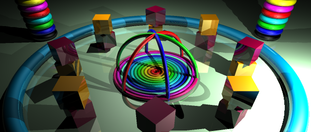
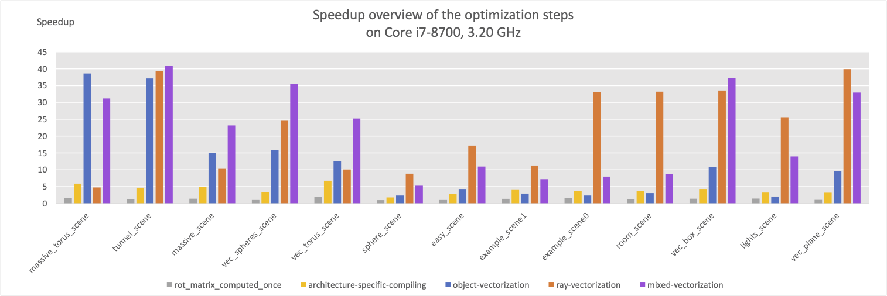

# AVX2 Sphere Tracer

C implementation of a sphere tracer applying various optimizations using AVX2 vector instructions. This our submission for the final project in the "Advanced Systems Lab" at ETH Zurich.



The spheretracer implements the following features: 
- Sphere tracing through implicit shapes
- Shadows
- Reflections (mirror and specular)
- Anti-Aliasing
- Multiple Light Sources
- 5 different types of objects

We start using a reference implementation and implement a series of improvements. We end up with 2 different optimized implementations:
- vectorization on object level
- vectorization on ray level
- mixed vectorization using ray vectorizaiton and switching to object vectorization when the latter is more efficient.


## Run Spheretracer

Runs the spheretrace algorithm on a user-defined test scene.
To build the binary, run ```make spheretrace```.

Usage: 
```
./spheretrace -s scene -m [auto|ray|obj|mixed] [-w width] [-h height]
```

`scene` can be any scene placed in `test_scenes/`

- The default width and height is 640x480. 
- The default execution mode is auto, which chooses between ray and mixed vectorization.
- If wanted, can choose the render mode specifically with the -m flag. 
- SCENE_NAME has to point to test_scenes/SCENE_NAME.json.


## Run tests
To run the tests, build the test binary with ```make test```.

Usage: 

```
./test -m [auto|ray|obj|mixed]
```
to run test on all scenes in test_scenes/ 
```
./test [-s scene1,scene2,...] -m [auto|ray|obj|mixed]
```
to only test selected scenes in `test_scenes/`.

All arguments are optional. If no list of scenes is provided, all scenes are tested.

Tests are carried out by comparing with the corresponding reference implementation output in `reference/`.


## Results
A summary of our performance speedup can be found below. For more details on implementation and result, see our [project report](Report.pdf).


